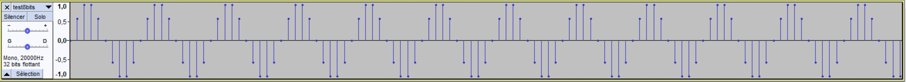
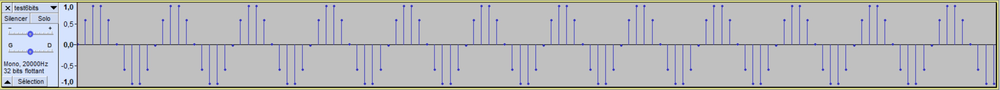
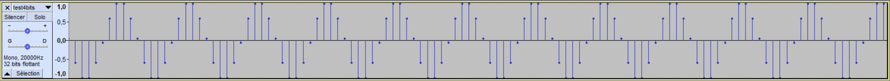
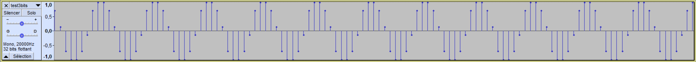
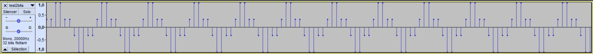
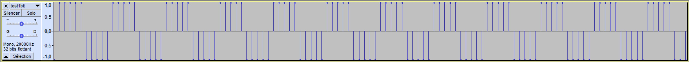

Projet Technologie des médias
----------------------

###### :pencil: Alex Broussard - Damien Carrier

## Partie 1 - Analyse du PCM – DPCM

### 1. Création du Signal

#### a. Création d'une tonalité de 2kHZ.

Le fichier se trouve dans le dossier, et se nomme 8bits.wav.
Le signal associé a ce fichier son est un signal sinusoïdale qui suit l'équation suivante : 

$$
A = \sin(2*\pi*t)
$$

#### b. Quantification du signal à 8bits/éch.

La courbe associé au signal 8bits.wav est la suivante (tracé à l'aide du logiciel Audacity):

#### c. Quantification pour 6bits/éch, 4bits/éch, 3bits/éch, 2bits/éch

Les quantification pour 6, 4, 3, 2 bits/éch sont les suivante.
Vous pourrez retrouver les sons dans le dossier avec les nom respectivement : 6bits.wav, 4bits.wav...

##### 6bits/éch :

La courbe associé au signal 6bits.wav est la suivante :

##### 4 bits/éch :

##### 3 bits/éch :

##### 2 bits/éch :

#### d. Quantification du signal avec 1 bit/éch.

Le signal crée avec 1bit/éch est le suivant : 

Le son ne ressemble plus au signal original, il y énormément de perte d'information.

Pour conclure sur cette question , pour 8 et 6 bits/éch il n'y a pas vraiment de différence à l'oreille mais à partir de 4 bits/éch on commence à entendre la différence ainsi qu'une légère baisse du niveau sonore. Ces différences s'accentuent plus le nombre de bits diminue.

### 2. Simulation de la latence

Dans le fichier **8bits_lentence.wav** vous trouver le son 8 bits/éch contenant des latences de 150, 200, 250, 300, 350, 400, 450 et 500ms qui rende le fichier complètement différent du fichier original.

### 3. Simulation de la perte de paquets

La simulation de la perte de paquet équivaut à mettre certaines valeur à 0. Nous allons donc générer un son à partir du son 8bits précédent en mettant de manière aléatoire certaines valeurs à 0.
Cette perte de paquet, avec une probabilité de perte de 10-2 altère fortement le son et à l'oreille il semble grésiller (*loss10^-2.wav*).

### 4. Simulation d'erreurs aléatoires

La simulation d'erreurs aléatoires ressemble à la simulation de perte, sauf qu'au lieu de mettre les valeurs à 0 cette fois-ci nous leur donnons une valeur aléatoires.
- Avec une probabilité d'erreurs de 10-2, le son généré (*error10^-2.wav*) ressemble à *loss10^-2.wav* qui avait la même probabilité de perdre un paquet. Le son grésille à l'oreille.
- Avec un probabilité d'erreurs de 10-3, le son grésille beaucoup moins mais encore bien assez pour que cette altération soit audible à l'oreille.

## Partie 2 - Analyse du PCM – DPCM

### 1. Impact de la latence

Comme précédemment, la latence n'est audible qu'au delà de 50ms.

### 2. Impact de la perte de paquets

La perte n'a pas le même impact que pendant la première partie,
en effet puisque les paquets sont calculés par rapport au précédent la perte
engendre deux paquets de même valeur alors que dans la partie 1 la perte entrainait l'absence
de valeurs.

Nous avons crée 2 fichiers à partir d'un taux de pertes du probabilités de 10-2 et 10-3 qui se nomme respectivement : DPCM_error_10^-2.wav et DPCM_error_10^-3.wav.

Donc plus le taux de perte est grands plus le son "grésille". 

### 3. Impact d'erreurs aléatoires

Comme les paquets sont liés les uns aux autres dans le cas du DPCM 
une erreur aléatoire va modifier toute la suite du signal.

## Partie 3 - Analyse du PCM – DPCM

### 1. Quantification de la voix Xtine

Les fichiers sont pour les latences 50ms, 100ms, 150ms, 200ms, 250ms sont respectivement : 

* xtine_50ms_latency.wav

* xtine_100ms_latency.wav

* xtine_150ms_latency.wav

* xtine_200ms_latency.wav

* xtine_250ms_latency.wav

**Conclusion** : 
La latence est encore une fois audible dès 50ms. Cependant pour comprendre ce que la femme dit il devient très difficile de le faire à partir de 150ms de latence.

### 2. Ajout de la latence réseau variable

Nous avons décidé de créer deux fichiers avec des latence aléatoire ayant une probabilité de 10-3 et 10-4 respectivement random_latency_10-3.wav et random_latency_10-4.wav.

On remarque donc que plus il y a de la latence plus il est difficile de comprendre le message original mais qu'avec des probabilités de latence de 10-2 et 10-3 le message est encore très compréhensible.

### 3. Simulation de la perte de paquets

Les fichiers pour la pertes de paquets sont les suivants : 

* xtine_10-1_loss.wav pour un taux de perte de 10-1

* xtine_10-2_loss.wav pour un taux de perte de 10-2

* xtine_10-3_loss.wav pour un taux de perte de 10-3

*Conclusion* : Plus le taux de perte est grand plus le grésillement de la voix augmente car nous perdons plus d'informations. Le message n'est plus compréhensible si le taux de perte est supérieur à 10-2.
